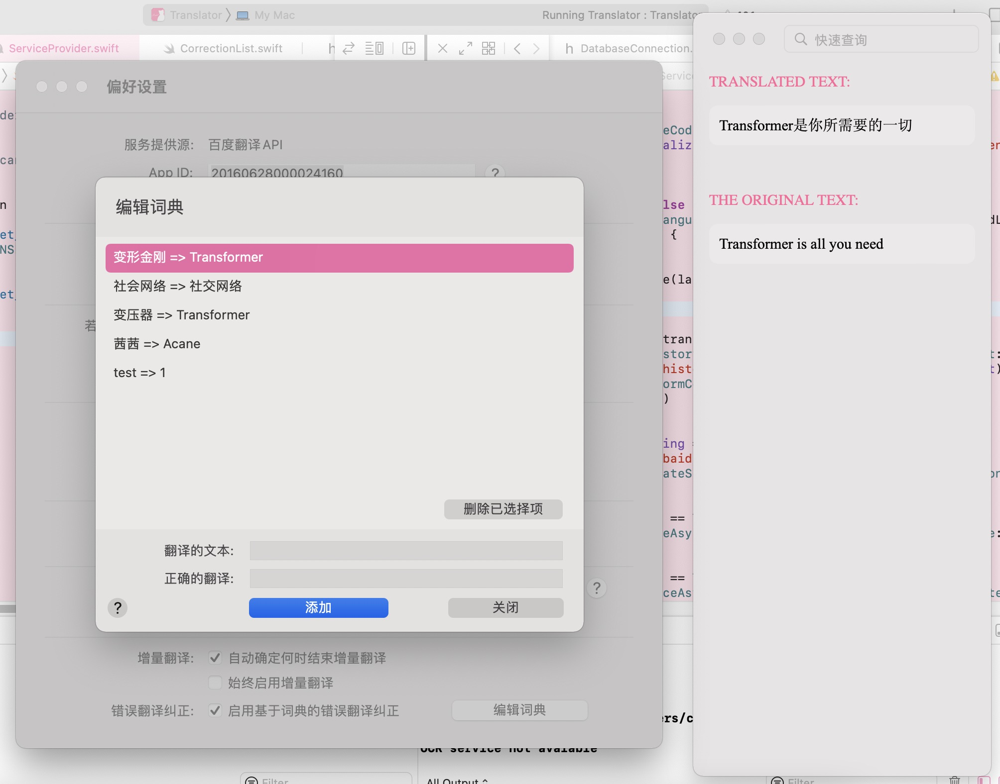

# Miyuki Translator

 

## Introduction

An application than can translate texts from clipboard.

* When reading paper, just copy the word or sentenses you want to translate, the translate result will show,
* 妈妈再也不用担心我看不懂论文啦 (Mom no longer has to worry that I can't read the paper)

## System Requirements
* MacOS 11.0 Big Sur or above

## Documentation for Developing Extension

This program supports extension. You can develop extension for new translation provider (or other sequence-to-sequence-like functions) of this program using native C, C++, and other languages. The only thing needed is 
to implement and export a dynamic library as a stanard C ABI, then put the compiled `.so` or `.dylib` to `Document` folder under application folder.

* <a href="docs/documentation_write_extension.md">Document and API references for developing an extension</a> *(in Simpified Chinese)*

## Main Features

### Copy & Translate

### Offline Translation

Still work without Internet connection.

Read papers and translate when you on board!

### Incremental Translation

### Translation Correction

`变形金刚` is not we want, `Transformer` is.

### Local OCR model support

-------

**Note**: The software has no longer been open-sourced since version v1.3.0.

All codes before v1.3.0 (not included) were licensed under GPLv3 (see LICENCE document with the source code). 

The authorities of code before version v1.3.0 (not included) that alreadly granted remain avaliable, but downloads of the source code of these versions will no longer provided.

-------
&copy; 2020-2022 Acane
